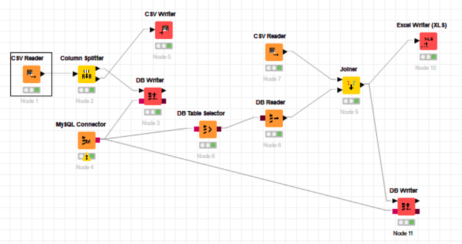

# Tugas 01 - ETL menggunakan KNIME

Repo ini berisi jawaban tugas 1 kelas Big Data oleh Alifiannisa Alyahasna Wighneswara (05111740000011), yaitu implementasi ETL menggunakan KNIME

 

## Business Understanding
**World Happiness Report** merupakan hasil dari survei yang dilakukan untuk mengetahui kondisi kebahagiaan global. Laporan ini terus mendapatkan pengakuan global karena pemerintah, organisasi dan masyarakat sipil semakin menggunakan indikator kebahagiaan untuk menginformasikan keputusan pembuatan kebijakan mereka. Pakar terkemuka di berbagai bidang - ekonomi, psikologi, analisis survei, statistik nasional, kesehatan, kebijakan publik, dan lainnya - menggambarkan bagaimana pengukuran kesejahteraan dapat digunakan secara efektif untuk menilai kemajuan negara. Laporan tersebut meninjau keadaan kebahagiaan di dunia saat ini dan menunjukkan bagaimana ilmu kebahagiaan yang baru menjelaskan variasi kebahagiaan pribadi dan nasional.

Laporan ini terdiri dari 6 bagian, yaitu laporan kebahagiaan global tahun 2015, 2016, 2017, 2018, dan 2019. Untuk tugas ini digunakan laporan tahun **2019**.

Ada banyak hal yang bisa digali dari laporan ini, di antaranya:

 1. Parameter mana yang paling mempengaruhi kebahagiaan suatu negara?
 2. Apa yang membedakan satu negara dengan negara lainnya?
 3. Bagaimana tingkat kebahagiaan suatu negara dibandingkan negara lainnya?

## Data Understanding

Pada laporan tahun 2019, laporan terdiri dari **9 kolom** dan **156 baris**. Baris-baris dalam laporan berisi nama negara, peringkat kebahagiaan, skor total, dan nilai dari masing-masing parameter penilaian.

 1. **Overall rank** : peringkat kebahagiaan suatu negara
 2. **Country** : nama negara yang dinilai
 3. **Score** : total nilai dari semua parameter
 4. **GDP per capita** : besarnya pendapatan rata-rata penduduk suatu negara
 5. **Social support** : rata-rata nasional tanggapan biner (0 atau 1) dari pertanyaan “Jika Anda dalam masalah, apakah Anda memiliki kerabat atau teman yang dapat Anda andalkan untuk membantu Anda kapanpun Anda membutuhkannya, atau tidak?"
 6. **Healthy life expectancy** : angka harapan hidup sehat untuk menghitung jumlah tahun dimana bayi yang baru lahir dapat hidup dengan sehat.
 7. **Freedom to make life choices** : rata-rata nasional tanggapan biner (0 atau 1) dari pertanyaan “Apakah Anda merasa puas atau tidak puas atas kebebasan untuk memilih jalan hidup Anda?"
 8. **Generosity** : rata-rata nasional dari respons terhadap pertanyaan, “Sudahkah Anda menyumbangkan uang untuk amal dalam sebulan terakhir?” tentang PDB per kapita.
 9. **Perceptions of corruption** : rata-rata jawaban biner untuk dua pertanyaan: "Apakah korupsi tersebar luas di seluruh pemerintah atau tidak?" dan "Apakah korupsi tersebar luas dalam bisnis atau tidak?".

## Data Preparation

Pada data preparation, file CSV harus dibuka terlebih dahulu menggunakan node **CSV Reader**. Adapun pengaturannya adalah sebagai berikut.

***Isi gambar konfigurasi dan tabelnya disini***

Untuk memisahkan data menjadi dua bagian digunakan node **Column Splitter**  Bagian pertama berisi kolom Overall rank, GDP per capita, Social support, Healthy life expectancy, Freedom to make choices, Generosity, dan Perceptions of corruption. Bagian kedua berisi kolom Country dan Score.

***Isi gambar SC 2 kolom disini***

Setelah itu, kolom pertama disimpan dalam database dan kolom kedua disimpan sebagai file CSV.

Untuk menyimpan kolom pertama, database di localhost harus disambungkan terlebih dahulu dengan KNIME menggunakan node **MySQL Connector**. Node ini memiliki kotak merah kecil di sebelah kanan yang akan disambungkan ke node lain. Pengaturan penyambungan database adalah sebagai berikut.

***Isi konfigurasi penyambungan database disini***

Setelah disambungkan ke database, partisi bagian pertama akan disimpan ke dalam database menggunakan node **DB Writer**. DB Writer memiliki dua konektor di sebelah kiri, berbentuk segitiga dan segi empat. Konektor segitiga dihubungkan dengan node yang berisi data, sedangkan konektor segi empat dihubungkan dengan MySQL Connector. Adapun pengaturannya adalah sebagai berikut.

***Isi konfigurasi DB Writer disini***

Setelah DB Writer dijalankan, di skema akan terbentuk satu tabel baru bernama scores yang merupakan tabel dari data pertama.

***Isi sc database disini***

Partisi bagian kedua akan disimpan ke dalam file CSV. Untuk menyimpan tabel ke dalam sebuah file CSV, dibutuhkan node **CSV Writer**. Node CSV Writer memiliki satu konektor di sebelah kiri dan dihubungkan dengan node yang berisi data. Adapun pengaturannya adalah sebagai berikut.

***Isi konfigurasi CSV Writer disini***

Setelah node dijalankan, file CSV baru akan terbuat dan akan terlihat seperti ini.

***Isi sc csv disini***

## Modeling
### Proses membaca data dari dua sumber
Data yang akan digabungkan berasal dari dua sumber yang berbeda dan berbeda bentuknya. Satu data berasal dari database dan satu data lagi berupa file CSV.

Untuk file yang berasal dari database, bisa digunakan node **DB Table Selector** untuk memilih tabel yang ingin dibaca dan node **DB Reader** untuk membaca tabel tersebut.

Node DB Table Selector memiliki satu konektor di sebelah kiri dan dihubungkan dengan node MySQL Connection. Adapun pengaturan node DB Table Selector adalah sebagai berikut.

***Isi konfigurasi DB Table selector dan sc hasilnya disini***

Untuk file berupa CSV, file dapat dibuka menggunakan node **CSV Reader**. Adapun pengaturannya adalah sebagai berikut.

***Isi konfigurasi csv reader dan sc hasilnya disini***

Setelah data-data dapat dibaca oleh KNIME, proses join atau append dapat dilakukan.

### Proses Join
Join adalah proses menggabungkan dua data pada KNIME. Data-data tersebut dapat berasal dari database ataupun file. Meskipun berbeda asal, data tetap dapat digabungkan oleh KNIME asal sudah dibaca terlebih dahulu.

Untuk melakukan join, dapat digunakan node **Joiner**. Node ini memiliki dua segitiga di sebelah kiri, masing-masing dihubungkan dengan node-node pembaca data. Segitiga atas dihubungkan dengan data yang akan menempati kolom sebelah kiri, dan segitiga bawah dihubungkan dengan data yang akan menempati kolom sebelah kanan. Apabila sudah tersambung, lakukan pengaturan node.

Dalam tugas ini, kolom yang digabungkan tidak memiliki primary key, sehingga data-data digabung secara apa adanya, dari baris ke baris. ID baris (Row ID) dianggap sebagai primary key.

***Isi konfigurasi joiner***

## Evaluation
Apabila node Joiner dieksekusi dan berhasil, hasil join akan dapat dilihat. Dalam tugas ini, penggabungan dua data dari dua sumber **berhasil** dilakukan.

***Isi sc joiner disini***

## Deployment
Setelah dua data digabungkan, data dapat disimpan kembali menjadi satu file ataupun disimpan ke dalam database.

Untuk menyimpan ke dalam database dapat digunakan node DB Writer dengan pengaturan sebagai berikut.

***Isi konfigurasi db writer***

Apabila sudah dijalankan, akan muncul satu tabel baru pada skema database yang dipilih.

***Isi sc db disini***

Untuk menyimpan tabel ke dalam sebuah file XLS, dibutuhkan node **Excel Writer**. Adapun pengaturannya adalah sebagai berikut.

***Isi konfigurasi excel Writer disini***

Setelah node dijalankan, file XLS baru akan terbuat dan akan terlihat seperti ini.

***Isi sc xls disini***
